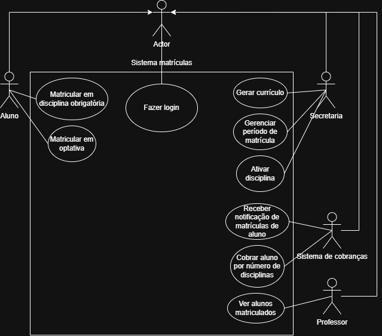

# Projeto PlantUML API

Este projeto foi desenvolvido para a matéria de Projetos de Software, do curso de Engenharia de Software da Pontiícia Universidade Católica de Minas Gerais. Se tratando do desenvolvimento de um sistema de matrículas infomatizado para uma universidade fictícia.

---

## Diagrama de casos de uso

|  |
|:---------------------:|
| Diagrama de casos de uso |

## Licença

Este projeto está sob a Licença MIT.
