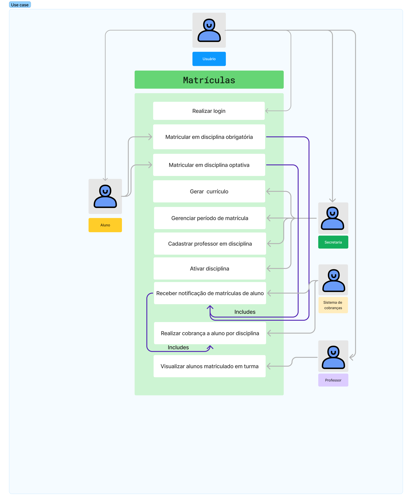

# Projeto de Sistema de Matrículas

Este projeto foi desenvolvido para a matéria de Projetos de Software, do curso de Engenharia de Software da Pontifícia Universidade Católica de Minas Gerais. Se tratando do desenvolvimento de um sistema de matrículas infomatizado para uma universidade.

---

## Diagrama de casos de uso

|  |
|:---------------------:|
| Diagrama de casos de uso |

## Histórias de usuário

| Usuário    |  Necessidade   | A fim de    |
|-------------|-------------|-------------|
| Aluno | Realizar a sua matrícula online | Poupar tempo de deslocamento a universidade para realizar a matrícula|
| Aluno | Visualizar o valor de sua mensalidade online | Ter estimativa de gastos com mensalidade |
| Aluno | Visualizar a sua grade de horários durante o processo de matrícula | Evitar horários vagos ou choque de horários | 
| Secretaria | Informatizar o sistema de matrículas de alunos | Ter maior controle sobre matrículas de alunos em disciplinas |
| Secretaria | Facilitar o processo de matrícula | Ter maior disponibilidade de funcionários para resolver outras pendências |
| Secretaria | Gerenciar a quantidade de alunos matriculados por disciplina | Evitar *_overbooking_* em disciplinas |
| Secretaria | Gerenciar a alocação de professores por disciplina | Ter maior controle sobre informções relacionadas as disciplinas |
| Secretaria | Gerenciar o período de matrículas | Evitar problemas em relação a matrículas fora de prazo |
| Professor | Gerenciar quantidade de alunos por sala | Ter informações sobre a quantidade de alunos matriculados por sala |
| Professor | Acessar a informações sobre o aluno como número de matrícula | Ter maior controle sobre informações relacionadas a alunos |

## Links Uteis

- [Diagrama de Casos de Uso no Figma](https://www.figma.com/board/wF6VISE7wazLz5nLJRs01S/Use-Case-(Copy)?node-id=0-1&t=9BhIaHnJ9eTdwW5z-1)

